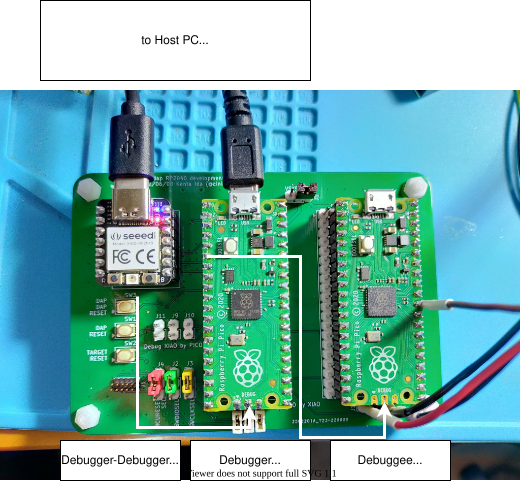

# A CMSIS-DAP implementation in Rust

[English](./README.md) 日本語
## 概要

Arm用のデバッグ・アダプタのプロトコルおよびファームウェアの規格であるCMSIS-DAPのRust実装です。

正しいWCID (Windows Compatibility ID) を返すことにより、Windowsでドライバの手動インストールを行わずに使用できます。
また、一部のボードではプローブ自体がGDBサーバとして動作し、ホストにOpenOCD/pyOCD/probe-rsを入れずにGDBからUSB-CDC経由で直接接続できます。

## 対応ボード

現在対応しているボードは以下の通りです。
各ボードごとの実装およびビルド・使用方法は、 [boards](./boards) ディレクトリ以下に含まれています。

| ボード名           | 対応機能         | ディレクトリ         |
|:------------------|:----------------|:--------------------|
| Seeeduino XIAO    | CMSIS-DAP       | [./boards/xiao_m0](./boards/xiao_m0) | 
| XIAO RP2040       | CMSIS-DAP, UART | [./boards/xiao_rp2040](./boards/xiao_rp2040) | 
| Raspberry Pi Pico | CMSIS-DAP (SWD/JTAG), UART, GDBサーバ, RTT | [./boards/rpi_pico](./boards/rpi_pico) | 
| Raspberry Pi Pico 2 | CMSIS-DAP (SWD/JTAG), UART | [./boards/rpi_pico2](./boards/rpi_pico2) | 
| Dabao Board (Baochip-1x) | GDB サーバ(USB 上の RSP)、RTT | [./boards/dabao](./boards/dabao) |

## ファームウェアの入手

各ボード向けのビルド済みファームウェア (UF2 / ELF) は [GitHub Releases](https://github.com/ciniml/rust-dap/releases) に添付しています。
ソースからビルドする場合は、各ボードのディレクトリで `cargo build --release` を実行します。指定できるfeatureは各ボードのREADMEを参照してください。

## USBの識別情報

ファームウェアは VID:PID `6666:4444`、manufacturer `fugafuga.org` として認識されます。

USBのシリアル番号(および `DAP_Info` のシリアル番号)にはボード固有のIDを使用しており、pico-sdk / debugprobe と同じ形式の16桁の大文字HEX (RP2040: QSPIフラッシュのunique ID、RP2350: OTPのchip ID) です。複数のプローブを `probe-rs --probe 6666:4444:<SERIAL>` のように区別できます。
以前のリリースでは `raspberry-pi-pico-swd` のような固定文字列だったため、これに依存したudevルールやプローブ指定を使っている場合は更新してください。

## ライセンス

ライセンスは `Apache-2.0 License` に従います。詳しくは [LICENSE](./LICENSE) ファイルを確認してください。
