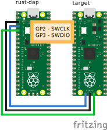

# Raspberry Pi Pico port

[English](./README.md) 日本語

## ピン配置



| ピン番号 | ピン名 | SWDピン接続先 | JTAGピン接続先 |
|:--------|:-------|:-------------|:--------------|
| 3       | GND    | GND          | GND           |
| 4       | GPIO2  | SWCLK        | TCK           |
| 5       | GPIO3  | SWDIO        | TMS           |
| 6       | GPIO4  | RESET        | nSRST         |
| 7       | GPIO5  |              | TDO           |
| 9       | GPIO6  |              | TDI           |
| 10      | GPIO7  |              | nTRST         |

## ビルド

### SWD用

デフォルトのfeatureではPIOを使ったSWD用のrust-dapをビルドします。

```
cargo build --release
```

feature `bitbang` を有効にすると、PIOを使ったSWD通信処理ではなく、GPIOをCPUで制御してSWD通信処理を行います。

```
cargo build --release --features bitbang
```

ホストからのクロックレートの設定を有効にするには feature `set_clock` を有効にします。 PIO向けの場合はかなり正確にクロックレートを設定できますが、bitbangの場合はそれなりです。

```
cargo build --release --features set_clock # PIO
cargo build --release --features set_clock,bitbang # bitbang
```

### JTAG用

JTAG用のファームウェアをビルドするには、 `--no-default-featrues` をつけて デフォルトで有効であるSWD機能のfeatureを無効化したうえで、 `jtag` featureを有効にします。

```
cargo build --release --no-default-features --features jtag
```

ホストからのクロックレートの設定を有効にするには feature `set_clock` を有効にします。

```
cargo build --release --no-default-features --features jtag,set_clock
```

## 使い方

### pyOCDを使う場合

#### pyOCDのインストール

```
python3 -m pip install pyocd
```

#### pyOCDの実行とGDB接続

```sh
pyocd gdbserver --target rp2040_core0
```

別のターミナルでgdb実行

Ubuntuのaptで入れられる `gdb-multiarch` だとアーキテクチャの認識に失敗するようなので、[Armのサイトからツールチェインをダウンロード](https://developer.arm.com/downloads/-/gnu-rm) して、その中のGDBを使う。

```sh
arm-none-eabi-gdb <target elf file> -ex "target extended-remote localhost:3333"
```

## スタンドアロン GDB サーバ(OpenOCD/probe-rs 不要)

このプローブ自体を GDB サーバにして、ホストに pyOCD/OpenOCD/probe-rs を
入れずに `gdb-multiarch` から直接ターゲットをデバッグできます(Black Magic
Probe 相当)。USB-CDC 上で GDB Remote Serial Protocol を喋ります。
詳細な手順・RTT の使い方は [doc/blink-demo.ja.md](../../doc/blink-demo.ja.md)。

### ビルド

ターゲットチップを feature で選びます。

```sh
# RP2040 ターゲット(デュアルコア/bootrom フラッシュ)
cargo build --release --bin gdb_server --features gdb-target-rp2040

# nRF52 ターゲット(単一コア/NVMC フラッシュ/APPROTECT)
cargo build --release --bin gdb_server --no-default-features --features gdb-target-nrf52

# 自動検出(挿さっている方を DPIDR で判別。含める family は feature で指定)
cargo build --release --bin gdb_server --no-default-features \
  --features gdb-target-auto,gdb-target-rp2040,gdb-target-nrf52
```

> nRF52 と RP2040 は SWD 線を共有できません(nRF は single-drop、RP2040 は
> multidrop)。auto は「挿さっている一方のターゲット」を自動認識します。

### 接続

CDC が 2 本現れます(若い番号 = GDB 用 RSP、次 = RTT 端末)。

```sh
# RP2040 は armv4t、nRF52(Cortex-M4)は armv7
gdb-multiarch <target.elf> \
  -ex 'set architecture armv4t' \
  -ex 'target remote /dev/ttyACM3'
```

対応: レジスタ/メモリ R/W、SW/HW ブレークポイント、ウォッチポイント、
`load`(フラッシュ書込)、`monitor reset` / `reset halt`、デュアルコア
(RP2040)、SEGGER RTT(`monitor rtt ...` + 2 本目の CDC へのライブ出力)。

### RTT(J-Link RTT Viewer 相当)

```gdb
(gdb) monitor rtt scan
(gdb) monitor rtt attach <addr>
(gdb) continue
```

別端末で 2 本目の CDC(`/dev/ttyACM4` 等)を `picocom` で開くと実行中の
ログが流れます。制御ブロックが見つからない(短命 RTT)場合の対処は
[doc/blink-demo.ja.md](../../doc/blink-demo.ja.md) を参照。
