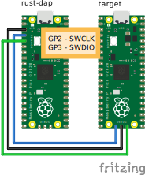

# Raspberry Pi Pico port

## ピン配置



| ピン番号 | ピン名 | SWDピン接続先 |
|:--------|:-------|:-------------|
| 3       | GND    | GND          |
| 4       | GPIO2  | SWCLK        |
| 5       | GPIO3  | SWDIO        |

## 使い方

### pyOCDを使う場合

#### pyOCDのインストール

```
python3 -m pip install pyocd
```

#### pyOCDの実行とGDB接続

```sh
pyocd gdbserver --target rp2040_core0
```

別のターミナルでgdb実行

Ubuntuのaptで入れられる `gdb-multiarch` だとアーキテクチャの認識に失敗するようなので、[Armのサイトからツールチェインをダウンロード](https://developer.arm.com/downloads/-/gnu-rm) して、その中のGDBを使う。

```sh
arm-none-eabi-gdb <target elf file> -ex "target extended-remote localhost:3333"
```
