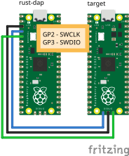

# Raspberry Pi Pico port

English [日本語](./README.ja.md)

## Pin assignments



| Pin Number | Pin Name | SWD pin | JTAG pin |
|:--------|:-------|:-------------|:--------------|
| 3       | GND    | GND          | GND           |
| 4       | GPIO2  | SWCLK        | TCK           |
| 5       | GPIO3  | SWDIO        | TMS           |
| 6       | GPIO4  | RESET        | nSRST         |
| 7       | GPIO5  |              | TDO           |
| 9       | GPIO6  |              | TDI           |
| 10      | GPIO7  |              | nTRST         |

## How to build

### For SWD

By default, this project is configured to use `features` to build the firmware for SWD with PIO.

```
cargo build --release
```

When the feature `bitbang` is enabled, the firmware performs SWD communication by controlling GPIO from CPU instead of PIO.

```
cargo build --release --features bitbang
```

When the feature `set_clock` is enabled, the firmware supports setting clock rate from the host. If the firmware uses PIO, the accuracy of the clock rate is fairly accurate. If the firmware uses bitbang, the accuracy is not good.

```
cargo build --release --features set_clock # PIO
cargo build --release --features set_clock,bitbang # bitbang
```

### For JTAG

In order to build firmware for JTAG, disable the default SWD features by specifying `--no-default-features` option and then enable the `jtag` feature.

```
cargo build --release --no-default-features --features jtag
```

Enable the feature `set_clock` to enable setting clock rate from the host PC.

```
cargo build --release --no-default-features --features jtag,set_clock
```

## How to use

### Use with pyOCD

#### Install pyOCD

```
python3 -m pip install pyocd
```

#### Run pyOCD and GDB connection

```sh
pyocd gdbserver --target rp2040_core0
```

Run GDB in another terminal.

`gdb-multiarch`, which is installed with `apt`, seems to fail to recognize the architecture correctly, so [download the toolchain from Arm's website](https://developer.arm.com/downloads/-/gnu-rm)
 and use GDB in it.

```sh
arm-none-eabi-gdb <target elf file> -ex "target extended-remote localhost:3333"
```

## Standalone GDB server (no OpenOCD / probe-rs)

The probe itself can act as a GDB server (like a Black Magic Probe): it speaks
the GDB Remote Serial Protocol over USB-CDC, so `gdb-multiarch` connects
directly without pyOCD/OpenOCD/probe-rs on the host. See
[doc/blink-demo.ja.md](../../doc/blink-demo.ja.md) for a walkthrough and RTT usage.

### Build

Select the target chip with features.

```sh
# RP2040 targets (dual core, bootrom flashing)
cargo build --release --bin gdb_server --features gdb-target-rp2040

# nRF52 targets (single core, NVMC flashing, APPROTECT)
cargo build --release --bin gdb_server --no-default-features --features gdb-target-nrf52

# Auto-detect (by DPIDR) among the families compiled in
cargo build --release --bin gdb_server --no-default-features \
  --features gdb-target-auto,gdb-target-rp2040,gdb-target-nrf52

# TI CC13x2/CC26x2 targets over 2-pin cJTAG (the chip has no SWD, so the
# cjtag transport is required)
cargo build --release --bin gdb_server --no-default-features --features gdb-target-cc13x2,cjtag
```

> With `cjtag`, GPIO2=TCKC, GPIO3=TMSC and GPIO4=nRESET (same wiring as SWD).
> The CPU DAP is enabled through ICEPick and flash is programmed via the ROM
> API (notes: [doc/cc13x2-cjtag-study.ja.md](../../doc/cc13x2-cjtag-study.ja.md)).

### Connect

Two CDC ports appear (lower number = GDB RSP, next = RTT terminal).

```sh
# RP2040 is armv4t; nRF52 / CC13x2 (Cortex-M4) are armv7
gdb-multiarch <target.elf> \
  -ex 'set architecture armv4t' \
  -ex 'target remote /dev/ttyACM3'
```

Supported: register/memory R/W, SW/HW breakpoints, watchpoints, `load`
(flash programming), `monitor reset` / `reset halt`, dual core (RP2040),
SEGGER RTT (`monitor rtt ...` plus live output on the second CDC port).

### RTT (J-Link RTT Viewer equivalent)

```gdb
(gdb) monitor rtt scan
(gdb) monitor rtt attach <addr>
(gdb) continue
```

Open the second CDC port (e.g. `/dev/ttyACM4`) with `picocom` in another
terminal to see the log while the target runs.
